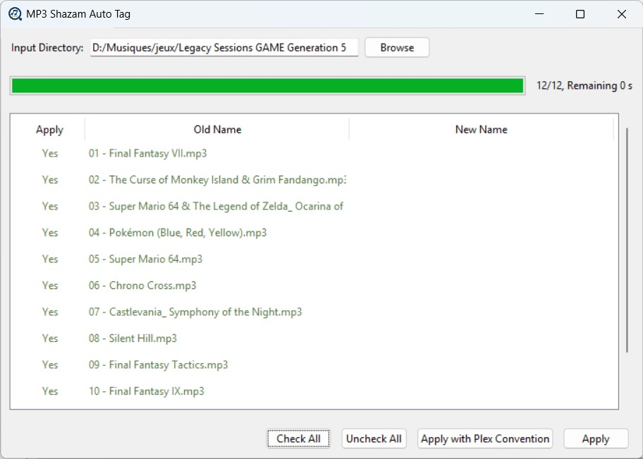

# MP3 File Recognizer and Renamer

This Python project automatically recognizes mp3 or ogg files using Shazam, renames them according to the recognized song title and artist, and updates their tags and cover art. In addition to the command‑line interface, a user‑friendly GUI is now available. You can download the executable file at the following address: [https://github.com/davidAlgis/mp3ShazamAutoTag/releases](https://github.com/davidAlgis/mp3ShazamAutoTag/releases).

> [!WARNING]  
> Your antivirus can quarantine the software, but as the source code of this repository it is completely harmless. Moreover, the first launch of the executable might be a bit long. 



## Usage

### Graphical User Interface (GUI)

A user‑friendly executable is now available as a zip file (download link above). This GUI allows you to:
- Select the input directory via a browse button.
- See a progress bar with file count and estimated remaining time.
- View a table of MP3 files with options to check/uncheck rows and directly edit the new file names.
- There are two different way to apply the changes :
  1. The "Apply" button just change the name of the file.
  2. The "Apply with Plex Convention" organize into Artist\Album\title_of_song

Simply unzip the file and run the executable.


## Manual Installation

Before running the script, create a clean environment and install the required Python libraries. For example:

```bash
pip install .
```

**Note:**  
- Ensure you have Python 3.6 or newer installed on your system.  
- There might be some issues with Python 3.11 and 3.12 (see [Issue #1](https://github.com/davidAlgis/mp3ShazamAutoTag/issues/1)).  
- macOS users may need to install *shazamio* manually (see [Issue #5](https://github.com/davidAlgis/mp3ShazamAutoTag/issues/5)).


## Command‑Line Interface

Alternatively, you can run the script from the command line. First, clone this repository (or download the files), install the required libraries as mentioned above, and then run:

```bash
python main.py [options]
```

### Options

| Short | Long           | Description                                                                                             | Default       |
| ----- | -------------- | ------------------------------------------------------------------------------------------------------- | ------------- |
| `-di` | `--directory`  | Directory where audio files are located. If not specified, the current working directory is used.       | *cwd*         |
| `-m`  | `--modify`     | Apply modifications to tags and filenames (`True`/`False`).                                             | `True`        |
| `-de` | `--delay`      | Delay (in seconds) before retrying Shazam if the call fails.                                            | `10`          |
| `-n`  | `--nbrRetry`   | Number of retries if Shazam fails.                                                                      | `3`           |
| `-tr` | `--trace`      | Enable tracing output (debug).                                                                          | `False`       |
| `-g`  | `--gui`        | Launch the GUI instead of running headless.                                                             | `True`       |
| `-e`  | `--extensions` | Comma-separated list of extensions to process (e.g. `mp3,ogg`).                                         | `mp3,ogg`     |
| `-o`  | `--output`     | Base output directory for moved files (keeps original folder if omitted).                               | *same folder* |
| `-p`     | `--plex`       | Organise output into Plex structure `Artist/Album/Title.ext` (CLI equivalent of the GUI’s Plex button). | *off*         |
| `-h`  | `--help`       | Show the help message and exit.                                                                         | —             |


## Building the Executable

This project can be built as a standalone executable using `pyinstaller`. To build the executable:


1. Move to a dedicated environment, the command (on windows) is:
   ```bash
   python -m venv venv
   venv\Scripts\activate
   ```

1. Install the required packages:

   ```bash
   pip install .
   pip install pyinstaller
   ```

2. Run the build command:

   ```bash
   pyinstaller --onefile --noconsole --icon="[full_path_to]\assets\auto_tag.ico" --add-data="[full_path_to]\assets\auto_tag.ico;assets" --workpath=build --distpath=build --specpath=build main.py
   ```

This will create a **build** folder with the executable and some temporary files.
